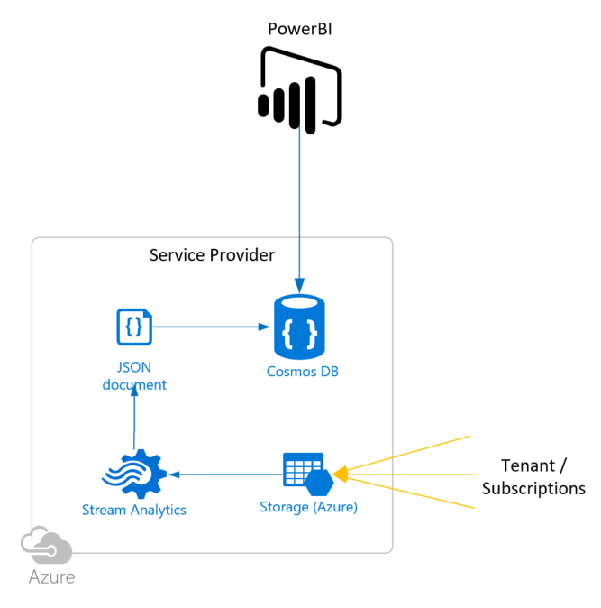

# zMonitor

## Service Provider / Central Deployment

Tenant / subscription operations monitoring is enabled through OMS Log Analytics. What you monitor and report on is dependent on the solutions and agents deployed, how monitoring is configured per workload in each tenant and the queries defined.

The service provider / central component of the solution is enabled using four core Azure components:

* Azure Storage Account
* Azure Automation
* Azure Stream Analytics
* Azure Cosmos DB

The overall process for tenant monitoring for the service provider is:



1. Receive tenant OMS logs as CSV in storage account container
1. Use Stream Analytics to move the CSV into Cosmos DB
1. Run cleanup process through Azure Automation at least daily (cleans up the CSV container)
1. Visualize. This solution provides a work in progress PowerBI sample for viewing data. Viusalization can be done through any mechanism familiar to the service provider, including existing tools as long as they can query Cosmos DB. PowerBI is provided for convenience.

## Deployment

<!--
**** PLACEHOLDER CONTENT FOR QUICKSTART ****
-->
Below are the basic steps required to deploy the service provider component of the solution, provided as interim guidance while working on the ARM template.

What's needed to setup the service provider components of zMontior.

* Storage Account (BLOBs)
  * Two containers
    * Main logs container - the container where the logs get dropped from subscriptions/tenants.
    * Archive lgos container
* Azure Autoamtion
  * Deploy runbook: [RB-Ops-CleanupDaily][1]
    * Schedule to run at least once a day
    * Update storage details in RB-Ops-CleanupDaily:
    ```PowerShell
    $StorageAccountName = "<STORAGE ACCOUNT>"
    $StorageContainerName = "<MAIN CONTAINER NAME>"
    $TargetStorageContainerName = "<ARCHIVE CONTAINER NAME>"
    $StorageAccountKey = "<STORAGE ACCOUNT KEY>"
    ```
* Azure Cosmos DB
    * Create database and collection
    * Remember to set Time To Live (TTL) - recommended to set to 7 days (604800 seconds)
    * Scale according to number of tenants, a starting scale on a single partition is 2000 RUs. 
* Stream Analytics
  * Configure input : storage account main logs containers
  * Configure output : CosmosDB collection
  * Define the query:
    ```SQL
    SELECT
        *
    INTO
        [CosmosDBOut]
    FROM
        [StorageContainerCSVs]
    ```
* Visualize - PowerBI
  * Configure connection to CosmosDB
  
    NOTE: Use the datasource connector "DocumentDB (Beta)"

<!-- LINKS -->
[1]:deploy/serviceprovider/PS-Ops-CleanupDaily.ps1