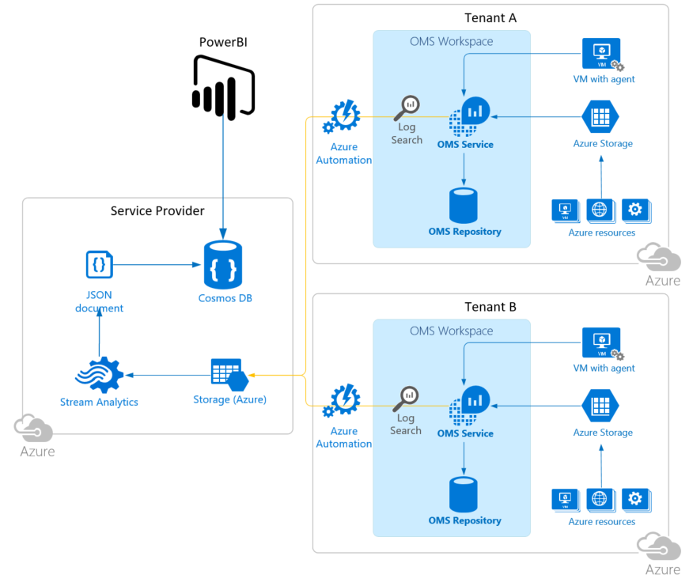
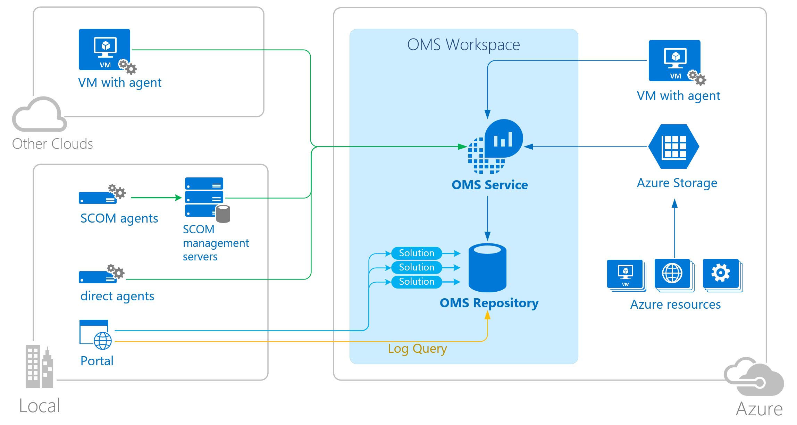

# zMonitor

An Azure platform native monitoring solution that enables Azure monitoring across multiple tenants or subscriptions.

## Overview

Problem statement: A service provider with 50 tenants with Azure subscriptions provisioned through CSP (Cloud Solution Provider), needing to consolidate operational telemetry to optimize running costs as well as deliver higher SLAs with a minimum amount of administrative overhead.

Enter zMonitor, a platform for reporting based on Log Analytics data collected, quickly gaining insights across tenants or subscriptions. Gain insights on disks capacity status, VM performance - over or under utilized CPU/Memory/Disk/etc, security vulnerabilities - failed logons, update/patch status, application errors, etc.

The primary goal is to utilize Azure native components, and deliver an as simple as possible, highly configurable and scalable, cost-effective monitoring solution. The driving force behind this solution was the need to be able to monitor Azure resources across tenants (for service providers), using Azure native tools. While there are many metrics and logs generated in Azure, surfacing this information across subscriptions/tenants and effectively monitoring proved challenging.

For an indication of potential costs for the solution, review the [cost estimate](Documentation/Cost-Estimate.md) documentation.

## Solution

For monitoring within subscriptions, OMS Log Analytics is leveraged as the native log and metric aggregation toolset in Azure. Using the free tier of Log Analytics will be sufficient for most cases, but depends on the number of resources being monitored and the metrics being collected.

Log Analytics data is then exported into a central Cosmos DB collection, from where it can be vizualized using any preferred tool. For this solution, PowerBI is used for demonstration purposes.

The components that make up the solution:

* Tenant / Subscription

  * Log Analytics
  * Azure Automation

* Service Provider / Central Repository

  * Azure Storage Account (BLOB)
  * Stream Analytics
  * Azure Cosmos DB
  * Azure Automation
  * [Optional] Power BI

For additional info on what is currently enabled through this solution (work in progress):

* [Reports/Queries](Documentation/Log-Reports.md)
* [Resources for writing Log Analytics queries](Documentation/Writing-Reports.md)

## Deployment

The detailed deployment instructions for the solution:

[Deploying monitoring for Tenant/ Subscription][6]

[Deploying the central repository (e.g. Service Provider)][7]

## Azure Resource Documentation

For more information on the individual components, please refer to the official documentation:

* [Log Analytics][1]

  <!---->

* [Azure Automation][2]

* [Stream Analytics][3]

* [Azure Cosmos DB][4]

* [Power BI][5]

## Contributions

Please refer to [CONTRIBUTING](Documentation/Contributing.md)

## License

This project has adopted the [Microsoft Open Source Code of Conduct](https://opensource.microsoft.com/codeofconduct/). For more information, see the [Code of Conduct FAQ](https://opensource.microsoft.com/codeofconduct/faq/) or contact [opencode@microsoft.com](mailto:opencode@microsoft.com) with any additional questions or comments.

The MIT License (MIT)

Copyright (c) 2016 Microsoft

Permission is hereby granted, free of charge, to any person obtaining a copy of this software and associated documentation files (the "Software"), to deal in the Software without restriction, including without limitation the rights to use, copy, modify, merge, publish, distribute, sublicense, and/or sell copies of the Software, and to permit persons to whom the Software is furnished to do so, subject to the following conditions:

The above copyright notice and this permission notice shall be included in all copies or substantial portions of the Software.

THE SOFTWARE IS PROVIDED "AS IS", WITHOUT WARRANTY OF ANY KIND, EXPRESS OR IMPLIED, INCLUDING BUT NOT LIMITED TO THE WARRANTIES OF MERCHANTABILITY, FITNESS FOR A PARTICULAR PURPOSE AND NONINFRINGEMENT. IN NO EVENT SHALL THE AUTHORS OR COPYRIGHT HOLDERS BE LIABLE FOR ANY CLAIM, DAMAGES OR OTHER LIABILITY, WHETHER IN AN ACTION OF CONTRACT, TORT OR OTHERWISE, ARISING FROM, OUT OF OR IN CONNECTION WITH THE SOFTWARE OR THE USE OR OTHER DEALINGS IN THE SOFTWARE.

<!-- LINKS -->
[1]: https://docs.microsoft.com/en-us/azure/log-analytics/log-analytics-overview
[2]: https://docs.microsoft.com/en-us/azure/automation/automation-intro
[3]: https://docs.microsoft.com/en-us/azure/stream-analytics/stream-analytics-introduction
[4]: https://docs.microsoft.com/en-us/azure/cosmos-db/
[5]: https://powerbi.microsoft.com/en-us/documentation/powerbi-landing-page/
[6]: Documentation/Deploy-Tenant.md
[7]: Documentation/Deploy-ServiceProvider.md
